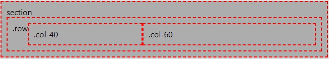

# Art Station - Components, section and elements styling

Style class:
- [Margins](#margins)
- [Widths](#widths)
- [Aligns](#aligns)
- [Columns](#columns)

***

## Margins
To add margin use this classes

### Margin top:
```
mt-10 - 10px top margin
mt-20 - 20px top margin
```

## Widths

```
width-max - 100% container width
width-50 - 50% container width
width-20 - 20% container width
```

## Aligns
To align content use:
```
center - center content of element
```

To align self element first set ``horizontal`` class to parent div column then to element like ``button`` one of following class:
```
left-self - align self element to left of container (flex-start)
center-self - align self element to center of container (center)
right-self - align self element to right of container (flex-end)
```

## Columns
Column element place inside section inside `.row` class element

**Example**


``` html
<section>
    section
    <div className="row">
        .row
        <div className="col-40">
            .col-40
        </div>
        <div className="col-60">
            .col-60
        </div>
    </div>
</section>
```

 `.col-20` - column 19% width\
 `.col-40` - column 39% width\
 `.col-50` - column 49% width\
 `.col-60` - column 59% width\
 `.col-80` - column 79% width\